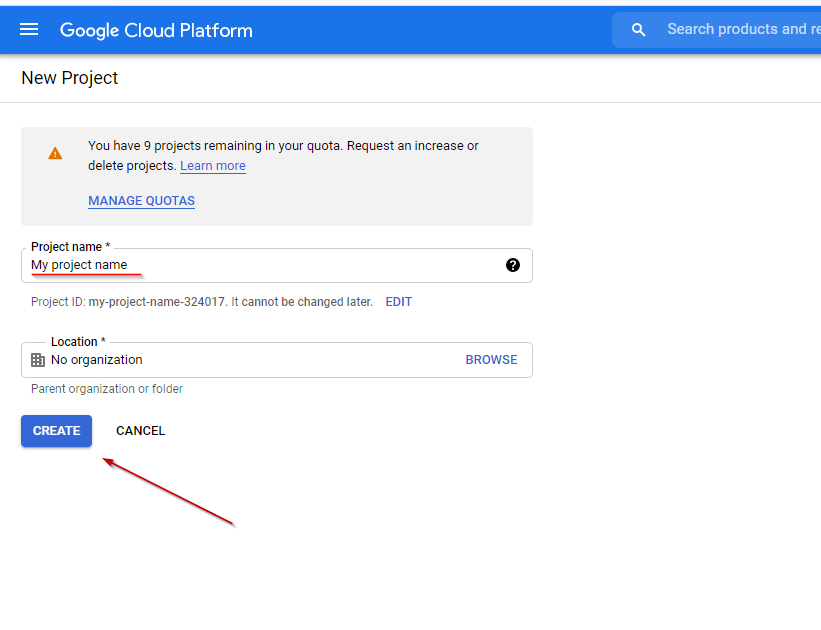
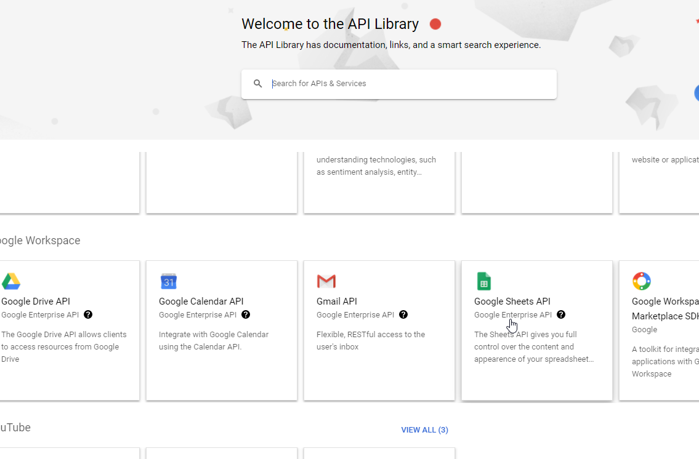
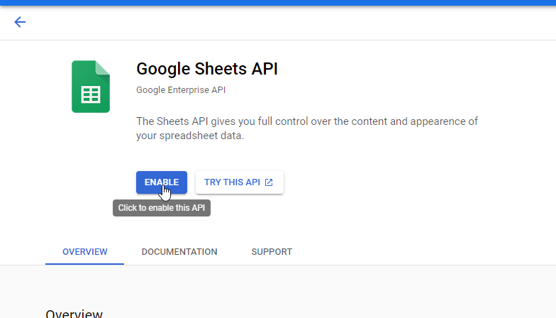
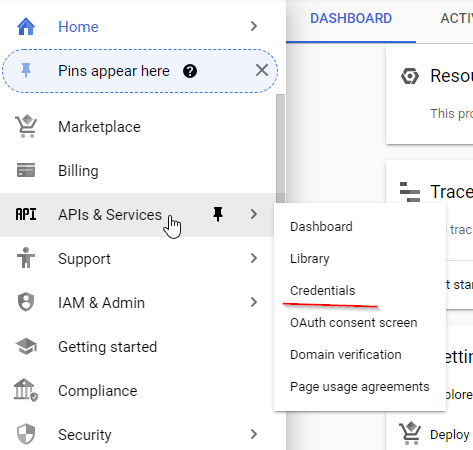
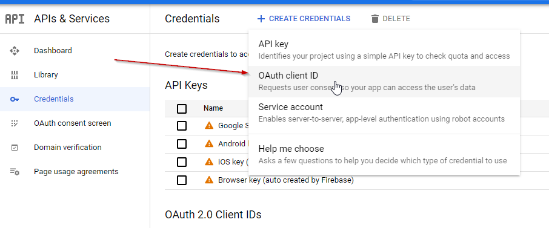
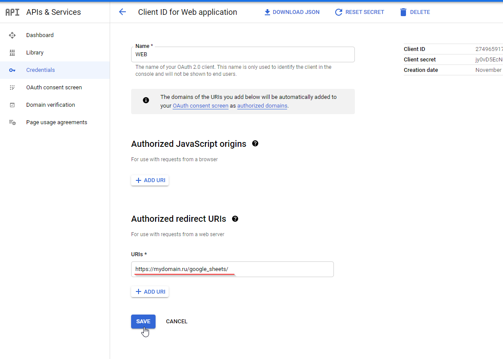
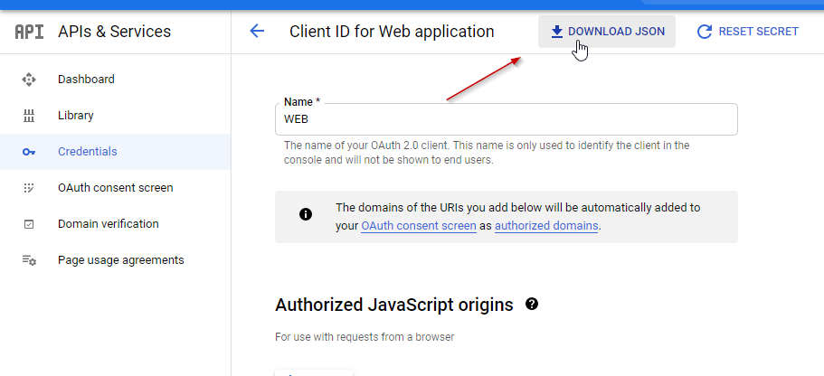
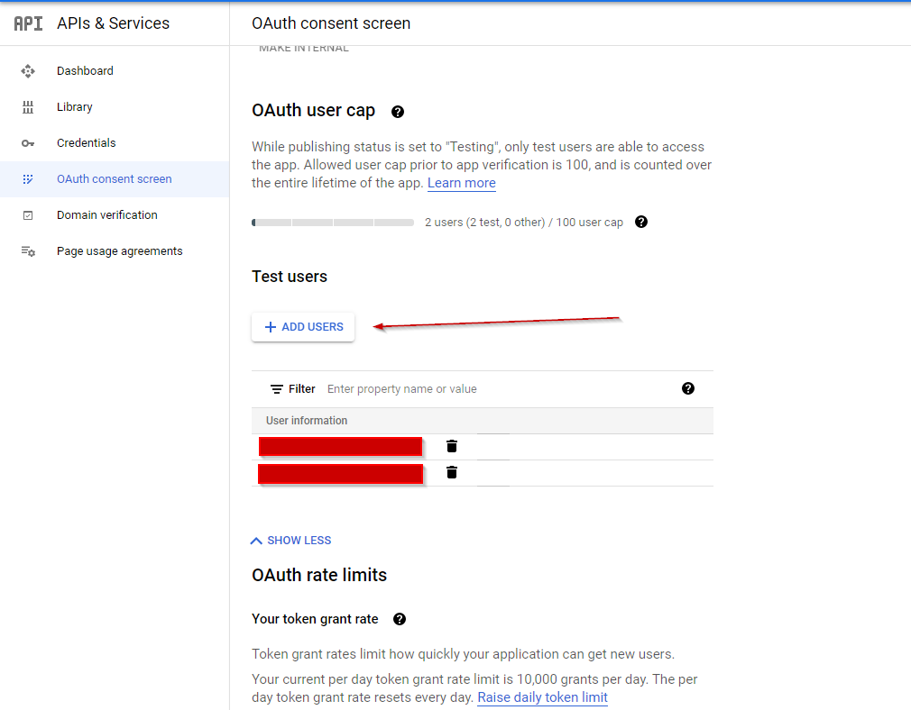
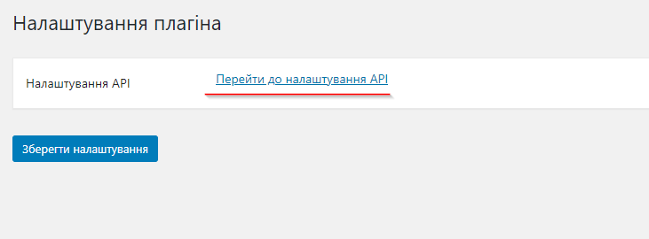

## Плагін `CMS Wordpress` для використання `Google Sheets API`

### Інструкція :

1. Скопіювати в папку wp-content/plugins

2. Створити проект на "Google Cloud Platform" це можна зробити за посиланням https://console.cloud.google.com/projectcreate

3. Включити "Google Sheets API" https://console.cloud.google.com/apis/library

4. Створити дозвіл "OAuth client ID"

5. Дозволити перенаправлення на "https://mydomain.ru/google_sheets/"

6. Завантажити створений ключ

7. Додати користувача від імені якого будемо робити запис в таблиці (це пов'язано з тим що спершу авторизація буде працювати в тестовому режимі і авторизуватись зможуть тільки додані в білий список користувачі)

8. Перейти до майстра налаштування плагіна і слідувати інструкціям

